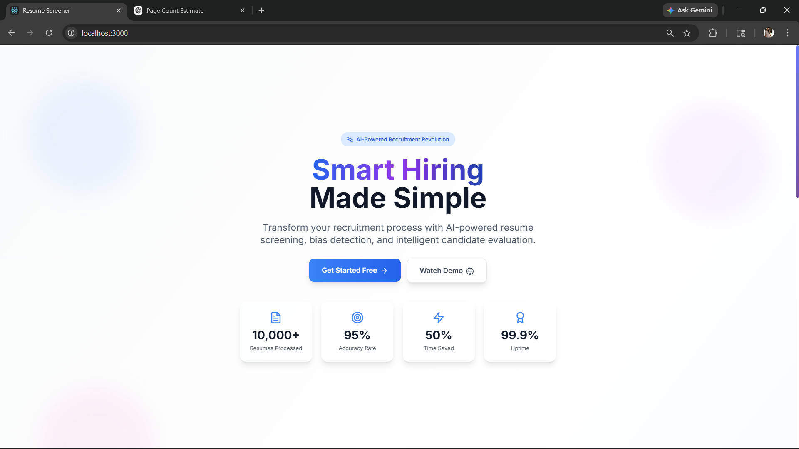
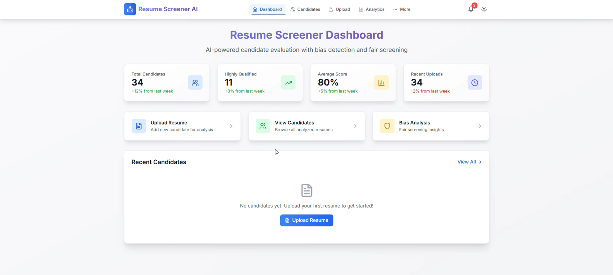

# AI-Based Resume Screening and Skill Gap Analysis System


An intelligent AI-powered recruitment platform that automates resume screening, semantic candidate evaluation, and skill gap analysis using Natural Language Processing (NLP), Machine Learning, and Large Language Models (LLMs).

---

## 🚀 Project Overview

The AI-Based Resume Screening and Skill Gap Analysis System is designed to assist recruiters in evaluating candidate resumes efficiently and accurately. The system performs semantic similarity matching between resumes and job descriptions, identifies missing skills, generates AI-powered recommendations, and provides candidate analytics through an interactive dashboard.

The platform combines modern web technologies with advanced AI models to improve hiring efficiency and candidate evaluation.

---

## ✨ Key Features

* AI-powered resume screening and analysis
* Semantic similarity matching using Sentence-BERT
* Skill extraction and classification
* Candidate ranking and scoring system
* Skill gap identification
* AI-generated hiring recommendations
* Interactive recruiter dashboard
* Resume upload and management
* Real-time analytics and visualization
* Responsive and modern user interface

---

## 🛠️ Technologies Used

### Frontend

* React.js
* Tailwind CSS
* Framer Motion
* React Router

### Backend

* Python
* Flask
* SQLite

### AI & Machine Learning

* Sentence-BERT
* Hugging Face Transformers
* Gemini API
* NLP Techniques

---

## 🧠 System Workflow

1. Recruiter uploads candidate resume
2. Resume text is extracted and preprocessed
3. Skills are identified using NLP techniques
4. Semantic similarity is computed between resume and job description
5. Final candidate score is generated
6. AI recommendations and insights are produced
7. Results are displayed in the dashboard

---

## 📊 Scoring Formula

Final candidate evaluation score is calculated using weighted semantic similarity and skill matching.

```text id="mwy53w"
Final Score = (0.6 × Semantic Score) + (0.4 × Skill Match Score)
```

---

## 📁 Project Structure

```text id="mth9lz"
AI-Resume-Screener/
│
├── backend/
│   ├── services/
│   ├── app.py
│   ├── requirements.txt
│   └── run.py
│
├── frontend/
│   ├── public/
│   ├── src/
│   ├── package.json
│   └── tailwind.config.js
│
├── README.md
├── render.yaml
└── netlify.toml
```

---

## ⚙️ Installation

### Clone Repository

```bash id="5fvgn0"
git clone https://github.com/Moni-shaa/AI-BASED-RESUME-SCREENING-AND-SKILL-GAP-ANALYSIS-USING-SEMANTIC-MATCHING-AND-LLM.git
```

---

### Backend Setup

```bash id="fnc6g4"
cd backend
pip install -r requirements.txt
python app.py
```

---

### Frontend Setup

```bash id="8y4jyc"
cd frontend
npm install
npm start
```

---


## 📷 Screenshots

## 📷 Screenshots

### Landing Page

<p align="center">
  
</p>

### Dashboard

<p align="center">
  
</p>

### Resume Analysis

<p align="center">
  
</p>

---

## 📈 Future Enhancements

* Multi-language resume support
* Advanced interview recommendation system
* Voice-based candidate analysis
* Cloud database integration
* Real-time recruiter collaboration

---

## 👨‍💻 Developed By

* Shajin Bala
* Monisha M

---

## 📄 License

This project is developed for academic and educational purposes only. Unauthorized commercial use is prohibited.
